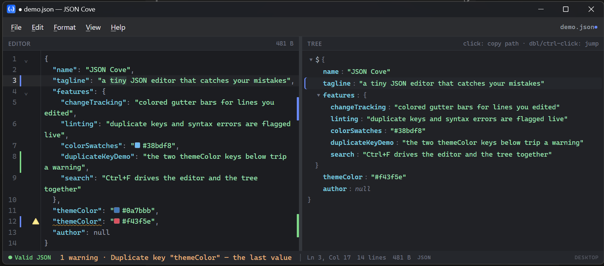

<div align="center">

# FemtoJSON

**A tiny, fast desktop JSON & JSONL viewer and editor for small files.**

[](https://github.com/markwu123454/femtojson/releases)
[](https://github.com/markwu123454/femtojson/releases)
[](LICENSE)
[](https://github.com/markwu123454/femtojson/releases)
[](https://tauri.app)

Opens in under a second, shows JSON in a clean dual view, with a formatted editor on
one side, a collapsible tree on the other, and lets you read, tweak a value,
and save without friction.

<br>



</div>

---

Built for the everyday case of opening a config file or an API response,
reading it, changing something, and moving on. **Not** built for gigabyte data
dumps.

## Download & install

Grab the latest build for your OS from the
[**Releases**](https://github.com/markwu123454/femtojson/releases) page:

| Platform    | File                             | What it is                                                      |
|-------------|----------------------------------|-----------------------------------------------------------------|
| **Windows** | `FemtoJSON_x.y.z_x64-setup.exe`  | NSIS installer — **recommended**                                |
| **Windows** | `FemtoJSON_x.y.z_x64_en-US.msi`  | MSI installer — for managed / enterprise deployment             |
| **macOS**   | `FemtoJSON_x.y.z_universal.dmg`  | Disk image, universal (Intel + Apple Silicon) — **recommended** |
| **macOS**   | `FemtoJSON_universal.app.tar.gz` | `.app` bundle tarball (also used by the auto-updater)           |
| **Linux**   | `FemtoJSON_x.y.z_amd64.AppImage` | Portable — runs on most distros, no install — **recommended**   |
| **Linux**   | `FemtoJSON_x.y.z_amd64.deb`      | Debian / Ubuntu package                                         |
| **Linux**   | `FemtoJSON-x.y.z-1.x86_64.rpm`   | Fedora / RHEL / openSUSE package                                |

The `.sig` files and `latest.json` alongside them are for the built-in
auto-updater, you don't need to download those.

The app isn't code-signed on any platform, so each OS shows a first-run warning:

- **Windows** — SmartScreen may warn; click **More info → Run anyway**. Needs the
  WebView2 runtime, which ships with current Windows.
- **macOS** — Gatekeeper blocks unsigned apps: **right-click the app → Open** the
  first time (or run `xattr -dr com.apple.quarantine "/Applications/FemtoJSON.app"`).
- **Linux** — for the AppImage, `chmod +x FemtoJSON*.AppImage` then run it; install the
  `.deb` with `sudo apt install ./FemtoJSON*.deb` or the `.rpm` with
  `sudo dnf install ./FemtoJSON*.rpm`.

After installing you can double-click any `.json`, `.jsonl`, `.ndjson`, or
`.ldjson` file, or use **Open with → FemtoJSON**.

## Features

- **Dual view** — a CodeMirror 6 editor with JSON highlighting, folding, bracket
  matching, and auto-closing brackets, beside a lightweight collapsible tree.
- **Open by drag-and-drop or double-click** — drop a file on the window, use the
  File menu, or set FemtoJSON as the default app and double-click.
- **Auto-format on load** — valid JSON is pretty-printed the moment it opens.
- **JSON Lines (JSONL / NDJSON / LDJSON)** — `.jsonl` / `.ndjson` / `.ldjson` files
  (or any file whose every line is a JSON record) open in JSONL mode: each record is
  validated on its own line and the tree shows them as an array.
- **Live validation, all errors at once** — every syntax error is underlined and
  marked in the gutter (not just the first); the status bar shows the count and
  the first error's line, and clicking it jumps there.
- **Duplicate-key warnings** — valid JSON that repeats an object key (where the
  last value silently wins) is flagged in the gutter and status bar.
- **Unified search (`Ctrl+F`)** — one search box drives both panes: the tree
  filters to matching keys/values (with the route to each hit revealed) while the
  editor highlights every hit and jumps to the current one. Toggle **Key** /
  **Value** / **case-sensitive** matching, step with `Enter` / `Shift+Enter`, or
  switch **Filter** off to dim non-matches instead of hiding them. The app
  captures `Ctrl+F` so the webview's own find never appears.
- **Find & Replace (`Ctrl+R`)** — press `Ctrl+R` to unfold a replace row beneath
  the same search bar (JetBrains-style — it never opens a second popup). The find
  row keeps all its toggles, so replace is **scoped to the matches**: with **Value**
  on it only rewrites values, with **Key** on only keys. **Replace** (or `Enter`)
  swaps the current match and advances; **Replace all** (or `Shift+Enter`) does the
  lot.
- **Inline tree editing** — double-click a leaf in the tree to edit its value in
  place (type-aware for strings, numbers, booleans, null); it writes straight back
  into the editor and is fully undoable. Also on the right-click menu as **Edit
  value**. (JSON mode.)
- **Right-click a tree node** — a Chrome-style menu to copy the **value** (raw),
  **value as JSON**, **key**, **`"key": value`**, **path**, or **path in bracket
  notation**; **Copy as CSV** for an array of objects; jump to the value;
  **Save subtree as…** to a new file; **Parse embedded JSON** to inline a string
  that is itself JSON (and **Escape as JSON string** for the reverse); or
  expand/collapse the whole subtree.
- **Keyboard navigation in the tree** — `↑` / `↓` (and `Home` / `End`) move between
  rows, `←` / `→` fold and unfold, `Enter` jumps the editor to the value.
- **Color swatches & timestamp hints** — any `#rgb` / `#rrggbb` in the editor gets a
  live color chip in front of it, and hovering a number that looks like a Unix epoch
  (seconds or milliseconds) shows the decoded UTC date.
- **Editor ↔ tree sync** — click a tree node to jump the editor there, and moving
  the editor cursor highlights the matching node back in the tree. If the cursor
  lands inside a collapsed subtree, the nearest visible ancestor is highlighted
  instead, so the caret marker is never lost.
- **Change tracking** — edited lines get a git-style bar in the gutter (green =
  added, blue = modified, red = deleted) mirrored on the scrollbar, diffed
  against the last saved version and cleared on save.
- **Click-to-copy JSON path** — click any tree node to copy its path
  (e.g. `$.window.width`) to the clipboard.
- **Jump to value** — double-click (or Ctrl-click) a tree node to move the editor
  cursor to that value and select it.
- **Menu bar** — a classic File / Edit / Format / View / Help menu with recent
  files, undo/redo, find/replace, go-to-line, sort-keys, JSON⇄JSONL conversion,
  copy-as-minified/formatted, word-wrap, zoom, and expand/collapse (all or to a
  level).
- **Sort keys** — recursively reorder object keys A→Z (works in JSONL too).
- **JSON ⇄ JSONL** — convert a top-level JSON array to JSON Lines (one record per
  line) and back again in one click.
- **Expand / Collapse to level** — show exactly 1, 2, or 3 levels of nesting, in
  both the tree and the editor's folds.
- **Word wrap + zoom** — toggle soft-wrapping and zoom with `Ctrl +` / `-` / `0`.
  Zoom targets whichever pane the pointer is over, so you can size the **editor**
  and the **tree** independently; both sizes (and wrap) persist between launches.
- **Editor right-click menu** — a Cut / Copy / Paste / Select All / Format / Minify
  menu replaces the webview's default (useless) context menu.
- **Node stats & record count** — selecting a container shows its child count and
  depth in the status bar; JSONL files show the record count.
- **External-change detection** — if the open file is changed by another program,
  FemtoJSON offers to reload it (desktop app only).
- **Save protection** — closing with unsaved changes prompts Save / Don't Save /
  Cancel; saving malformed JSON asks for confirmation first (a soft warning,
  never a hard block).
- **Sensible undo** — opening a file resets the undo history, so Ctrl+Z stops at
  the loaded document instead of wiping the editor.
- **Format / minify** — one click each, with keyboard shortcuts.
- **OS-following dark mode** — light and dark themes track the system setting,
  live.
- **Recent files + window memory** — remembers recent files and restores window
  size and position between launches.

## Scope

Optimized for files up to a few hundred KB, in either JSON or JSONL form. There
is no streaming, virtualization, or large-file handling — that omission is
deliberate and is what keeps the codebase small and startup near-instant.

## Keyboard shortcuts

| Action                 | Shortcut                                       |
|------------------------|------------------------------------------------|
| New                    | `Ctrl+N`                                       |
| Open                   | `Ctrl+O`                                       |
| Save                   | `Ctrl+S`                                       |
| Save As                | `Ctrl+Shift+S`                                 |
| Format                 | `Ctrl+Shift+F`                                 |
| Minify                 | `Ctrl+Shift+M`                                 |
| Search (tree + editor) | `Ctrl+F`                                       |
| Replace                | `Ctrl+R`                                       |
| Next / previous match  | `Enter` / `Shift+Enter`                        |
| Replace / replace all  | `Enter` / `Shift+Enter` (in the replace field) |
| Go to line             | `Ctrl+G`                                       |
| Zoom in / out / reset  | `Ctrl+ +` / `-` / `0`                          |
| Undo / Redo            | `Ctrl+Z` / `Ctrl+Y`                            |

In the tree: **click** a node to copy its path, **double-click a leaf** to edit
its value in place (**double-click a container** or **Ctrl-click** jumps the
editor cursor to that value instead), **arrow keys** to navigate (`↑` / `↓` move,
`←` / `→` fold, `Enter` jumps), and **right-click** for copy / edit / convert /
save / expand actions.

## Stack

| Layer      | Choice                                                    |
| ---------- | --------------------------------------------------------- |
| Shell      | [Tauri 2](https://tauri.app) (Rust backend, OS webview)   |
| Editor     | [CodeMirror 6](https://codemirror.net)                    |
| Tree       | Custom Svelte component                                   |
| UI         | [Svelte 5](https://svelte.dev) + [Vite](https://vite.dev) |

The result is a few-MB binary that launches almost instantly.

## Build from source

Prerequisites: [Node.js](https://nodejs.org) 18+, the
[Rust toolchain](https://rustup.rs), and the platform dependencies from the
[Tauri prerequisites](https://tauri.app/start/prerequisites/). On Windows that
means the Visual Studio C++ Build Tools and the WebView2 runtime (bundled with
current Windows).

```bash
git clone https://github.com/markwu123454/femtojson
cd femtojson
npm install          # install frontend dependencies

npm run app:dev      # run the desktop app with hot reload
npm run app:build    # produce an optimized installer + binary

npm run dev          # run just the frontend in a browser (shows sample data)
npm run build        # build just the frontend bundle
```

`npm run app:build` writes the binary and installers under
`src-tauri/target/release/` (the `.exe`) and
`src-tauri/target/release/bundle/` (the `.msi` and NSIS `-setup.exe`).

### Where things live

```
src/                     Frontend (Svelte)
  App.svelte             Layout, menus, actions, OS integration, status bar
  lib/
    MenuBar.svelte       Classic dropdown menu bar
    SearchBar.svelte     Unified tree + editor search bar
    ContextMenu.svelte   Right-click copy/jump menu for tree nodes
    Editor.svelte        CodeMirror wrapper: highlighting, folding, linting, search, path seek
    editor-theme.js      Light/dark CodeMirror theme + syntax colors
    change-gutter.js     Git-style change tracking (gutter + scrollbar overview)
    Tree.svelte          Tree container
    TreeNode.svelte      Recursive, collapsible tree node (search filter + highlight)
    json.js              Pure JSON helpers (paths, previews, sizes, search)
    tauri.js             Bridge to the backend (degrades gracefully in a browser)
src-tauri/               Backend (Rust / Tauri)
  src/lib.rs             Commands (read/write/initial file) + plugin setup
  tauri.conf.json        Window, bundle, and file-association config
  capabilities/          Tauri permission grants for the main window
```

## License

[GNU Affero General Public License v3.0 or later](LICENSE) © Mark Wu.
